# CloudHawk — Smart Web-Based Employee Attendance & Workforce Tracking System

> Formerly *GeoAttend Pro*. A production-grade attendance & productivity platform for companies
> with or without a physical office. Employees mark attendance using **GPS geofencing + live
> selfie + face verification**, while a real-time **work-tracking state machine** (Working →
> Rest → Overtime → Logged Out) monitors actual working time. Includes leave, payroll, expenses,
> tasks, help-desk, multi-branch support, reporting and full auditing.

| Layer     | Technology |
|-----------|-----------|
| Frontend  | React 18 (Vite), React Router, Axios, Chart.js, Bootstrap 5 + Icons |
| Maps/AI   | Leaflet + OpenStreetMap (geofence picker), face-api.js (face match), jsPDF + autotable (PDF) |
| Backend   | PHP 8.2 REST API (clean MVC, no framework lock-in), PDO |
| Database  | MySQL / MariaDB 10.4+ |
| Auth      | Opaque session tokens, session timeout, CSRF double-submit, RBAC |

```
GeoAttendPro/
├── backend/                 PHP REST API
│   ├── config/              env loader + bootstrap (autoloader)
│   ├── console/             CLI: migrate.php, cron.php
│   ├── database/            schema.sql, seed.sql, phase2..phase9 migrations
│   ├── public/              front controller (index.php) + .htaccess + uploads
│   └── src/
│       ├── Core/            Database, Router, Request, Response, Auth, Csrf, Validator
│       ├── Middleware/      AuthMiddleware, CsrfMiddleware
│       ├── Models/          User, Attendance, AttendanceSession, AttendanceEvent, Leave,
│       │                    Shift, Holiday, Document, Announcement, ExpenseClaim, Task,
│       │                    Ticket, Client, Purchase, Department, Designation, Notification
│       ├── Services/        AttendanceService, PayrollService (business rules)
│       ├── Support/         Activity, Geo, Settings, Uploader, Mailer, Guard
│       └── Controllers/     Auth, Employee, Attendance, Leave, Dashboard, Report, Payroll,
│                            Celebration, Announcement, Expense, Task, Ticket, Client, Purchase, ...
├── frontend/                React SPA (Vite)
│   ├── public/              cloudhawk.png (brand logo)
│   └── src/{api,context,components,pages,utils}
└── docs/                    SRS, diagrams, API, deployment, testing
```

## Project Workflow

### System architecture
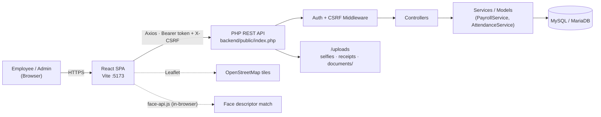

### Attendance check-in / out flow
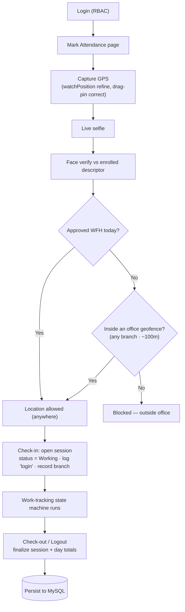

### Work-tracking state machine
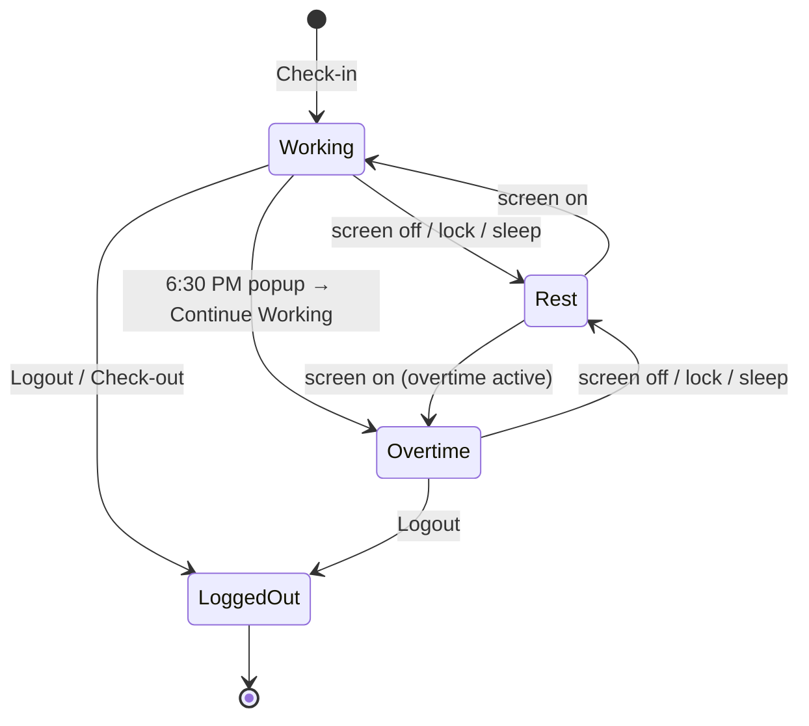

> 🟢 Working · 🟡 Rest Mode · 🔵 Overtime · ⚫ Logged Out — surfaced live on the
> **Admin Live Status** board and the employee dashboard timeline.

### Leave / WFH approval flow
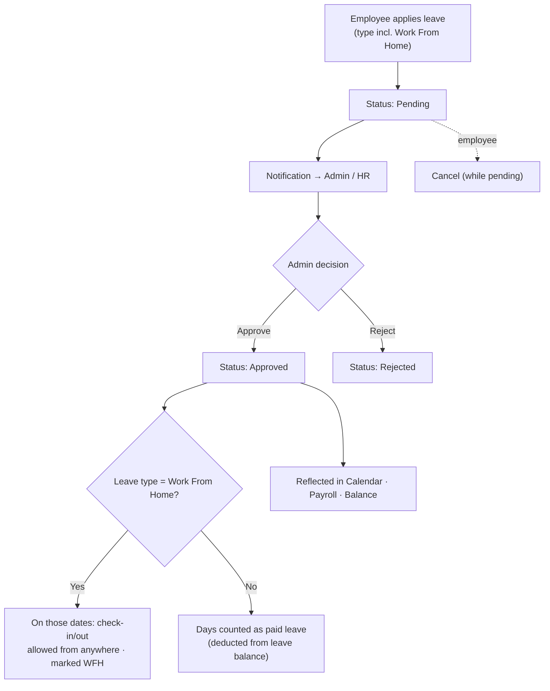

### Payroll calculation flow (attendance-driven)
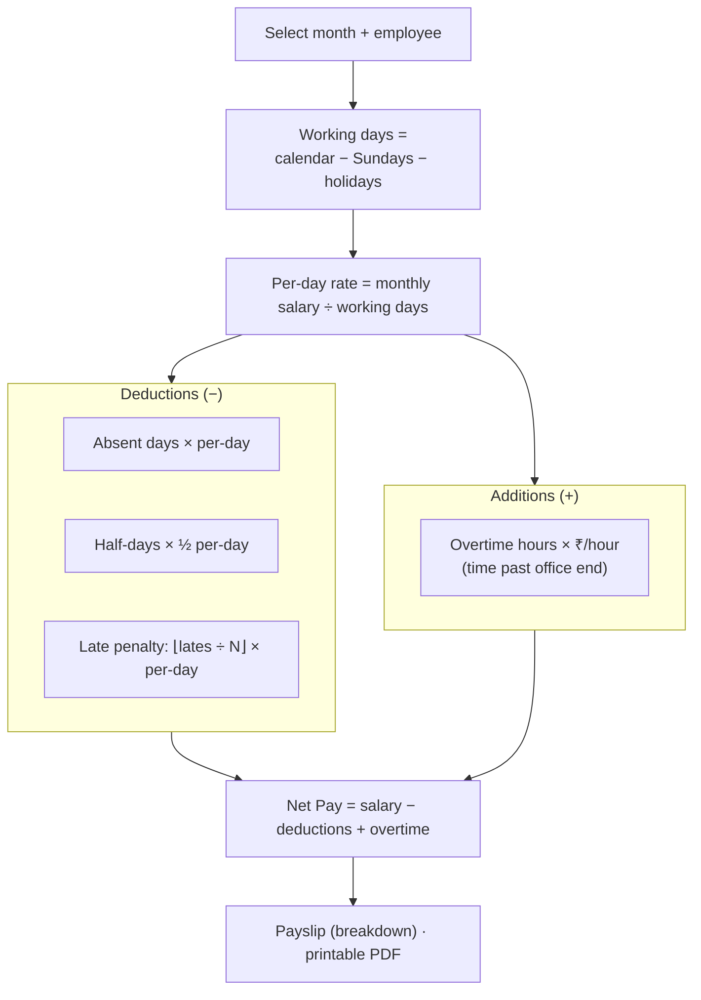

### Expense claim flow
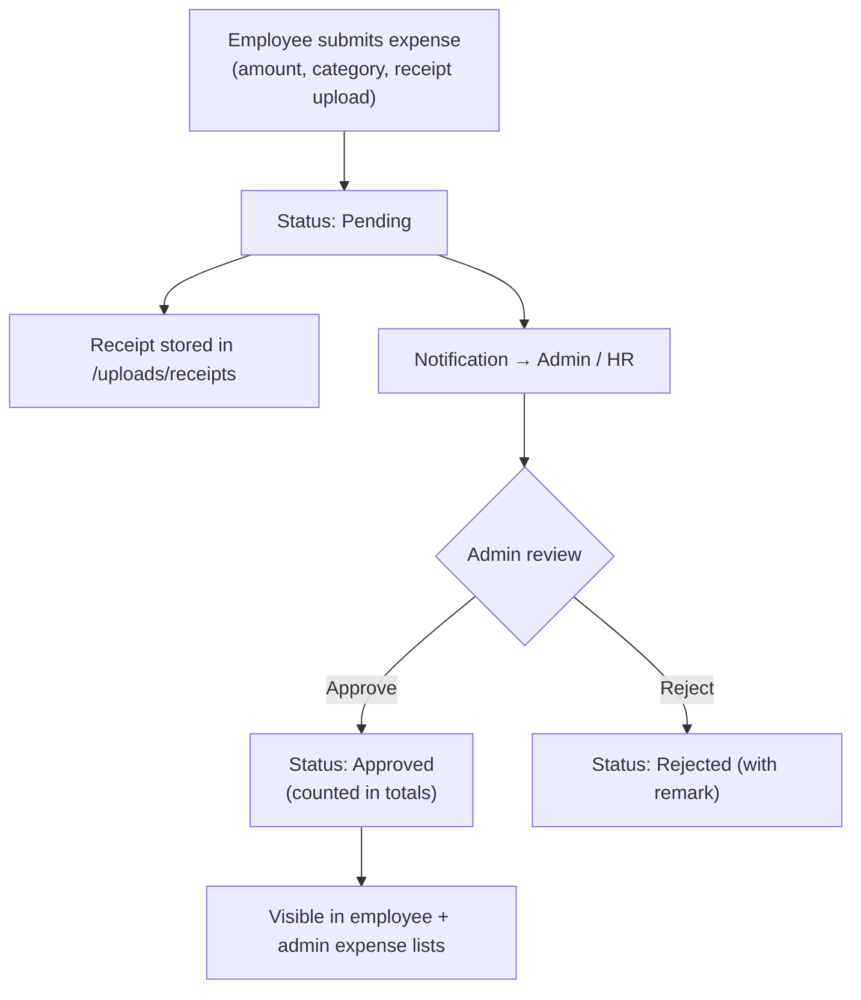

### Attendance regularization flow
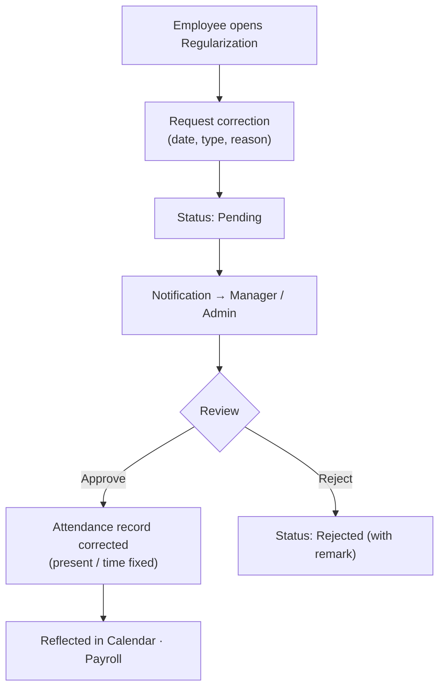

### Roles & access (RBAC)
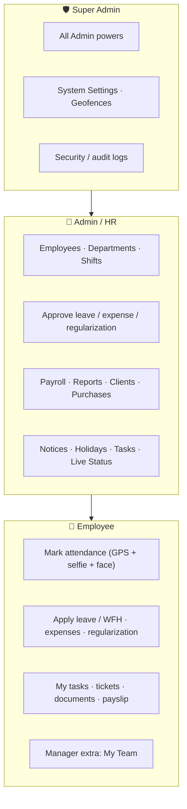

### Use-case diagram
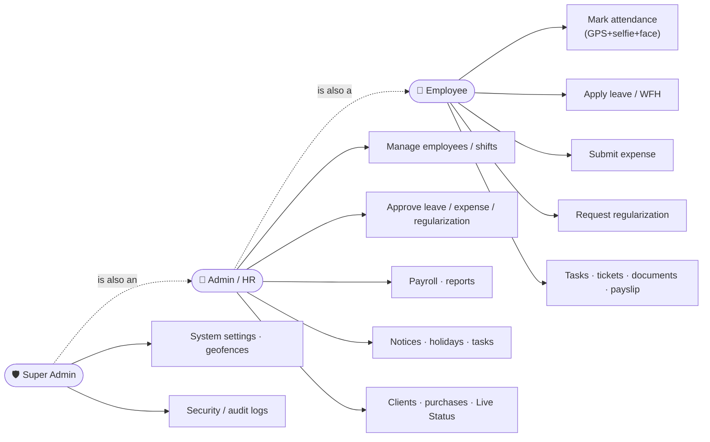

### Authentication & session sequence
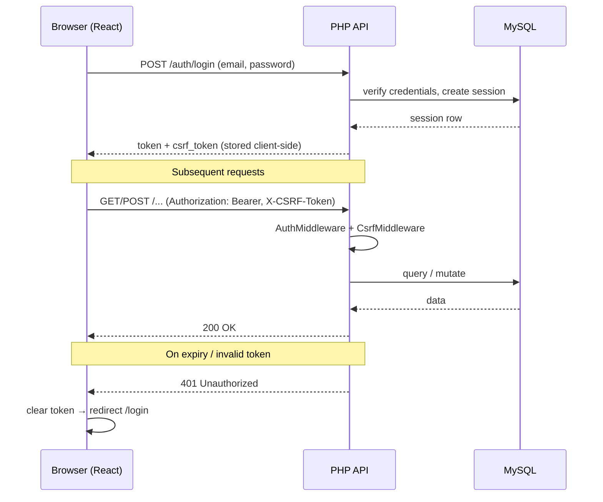

### Deployment (XAMPP)
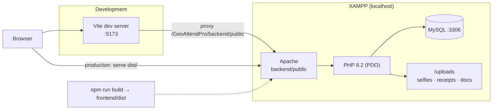

### Entity-Relationship (core)
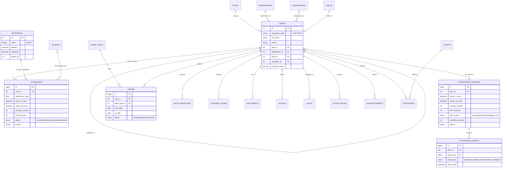

## Features

### Attendance & location
- **GPS + live selfie** check-in / check-out, multiple sessions per day.
- **Face verification** (face-api.js) — captured selfie is matched against an enrolled face to stop proxy attendance.
- **Geofencing** — check-in/out allowed only inside an office geofence (e.g. 100m). Multiple **branches** supported (any active geofence matches); the matched branch is recorded per check-in.
- **Work From Home** — employees with an approved *Work From Home* leave can check in/out from anywhere.
- **Interactive map** (Leaflet) on the attendance page: shows the captured point + accuracy circle + office geofences; the pin can be dragged to the exact spot when GPS is coarse. GPS accuracy is refined via `watchPosition` (best-of, early-exit ≤25m).
- **Attendance Calendar** — month grid of present/late/half-day/leave/holiday, with **Sundays as company week-off**.
- **Regularization** — employees request corrections for missing/wrong attendance; admin approves.

### Smart work-tracking state machine
- States: 🟢 **Working** · 🟡 **Rest Mode** · 🔵 **Overtime** · ⚫ **Logged Out**.
- **Rest** is detected only on genuine **screen-off / lock / sleep** (clock-gap while the tab stays visible) — switching browser tabs/apps never counts as rest.
- **6:30 PM popup** ("standard working duration reached") → *Logout* or *Continue Working*; continuing starts **Overtime mode** with a reminder every 30 minutes.
- Full **timeline** per day (login, rest start/end, overtime start, logout) in `attendance_events`.
- **Admin Live Status board** — real-time per-employee status + Login/Active/Rest/Overtime durations (15s auto-refresh).

### Leave, payroll & finance
- **Leave management** — apply / approve / reject / cancel, leave types with yearly limits, **per-type leave balance**.
- **Payroll** (attendance-driven): working days = calendar − Sundays − holidays; per-day rate; deductions for **absent**, **half-days** and a configurable **late penalty** (N lates = 1 day cut); **overtime incentive** (₹/hour past office end time) added on top; printable payslip with full breakdown.
- **Expense claims** with receipt upload and approve/reject.
- **Clients / Customers / Vendors** management and **Purchases** (office product entries).

### Workforce & communication
- **Employee management**, departments, designations, **shifts** (per-employee timing & late rules), **manager hierarchy** ("My Team").
- **Notice Board** (announcements, pinned), **Holidays** (with recurring), **Tasks** (assign + status), **Help Desk** tickets.
- **Celebrations** — birthday & work-anniversary alerts.
- **Documents** — per-employee document upload.
- **Notifications** (in-app) + email hooks; **activity / security audit log**.

### Dashboards & reporting
- **Employee dashboard** — quick actions, attendance %, today vs monthly hours, monthly hours target, live work status + timeline, net pay, open tasks/tickets, latest notice, upcoming holidays, celebrations.
- **Admin dashboard** — live counters, status pie, daily/monthly trends, department breakdown, recent check-ins, pending leaves.
- **Reports** with charts and **PDF export** (jsPDF).
- **Settings** — work start/end time, late grace, half/full-day minutes, late-per-deduction, overtime rate, geofence enforcement & geofence map picker.

### Platform
- **RBAC**: Super Admin, Admin/HR, Employee. CSRF on state-changing routes; opaque token sessions.
- Employee IDs use the **`CLHK-####`** prefix.
- **CloudHawk** branding (logo + name) across landing, auth and app shell.

## Database migrations

`schema.sql` + `seed.sql` create the base; phase migrations add later features (idempotent):

| Migration | Adds |
|-----------|------|
| `phase2.php` | shifts, regularizations, users.shift_id/manager_id |
| `phase3.php` | documents, face descriptor |
| `phase5.php` | clients, purchases |
| `phase6.php` | announcements, expense_claims, tasks, tickets |
| `phase7.php` | attendance(.rest_seconds) — active vs rest time |
| `phase8.php` | work_status, overtime, rest/overtime markers, attendance_events timeline |
| `phase9.php` | attendance(.branch) — multi-branch tracking |

```bash
cd backend
"D:/xampp/php/php.exe" console/migrate.php     # base schema + seed
"D:/xampp/php/php.exe" database/phase2.php      # then run phase3..phase9 in order
```

## Quick start

### 1. Database
```bash
# Ensure MySQL/MariaDB is running. Configure backend/.env (DB_HOST/PORT/USER/PASS).
cd backend
php console/migrate.php        # creates schema + seed data
# run phase2.php … phase9.php (above) to apply all features
```

### 2. Backend API
Serve `backend/public` via Apache (XAMPP) at `http://localhost/GeoAttendPro/backend/public`,
or for development:
```bash
cd backend/public
php -S 127.0.0.1:8000 index.php
```

### 3. Frontend
```bash
cd frontend
npm install
npm run dev            # http://localhost:5173 (Vite proxies API to Apache)
```
Set `frontend/.env` → `VITE_API_BASE_URL` to the backend URL.

### Default logins
| Role        | Email                          | Password      |
|-------------|--------------------------------|---------------|
| Super Admin | superadmin@geoattend.test      | Admin@123     |
| Admin / HR  | hr@geoattend.test              | Admin@123     |
| Employee    | john@geoattend.test            | Employee@123  |

> Browser geolocation + camera require **HTTPS or localhost**. On `localhost` both work in dev.
> A laptop has no GPS chip, so it uses WiFi/IP location (coarse) — drag the map pin to correct it,
> or mark attendance from a phone for precise GPS.

## Documentation
See [`docs/`](docs/):
1. [Software Requirements Specification](docs/01-SRS.md)
2. [System Architecture, Sequence & Workflow Diagrams](docs/02-architecture.md)
3. [ER Diagram & Database Design](docs/03-database.md)
4. [API Design](docs/04-api.md)
5. [Security & Validation Rules](docs/05-security-and-validation.md)
6. [Deployment Guide](docs/06-deployment.md)
7. [Testing Plan](docs/07-testing.md)
