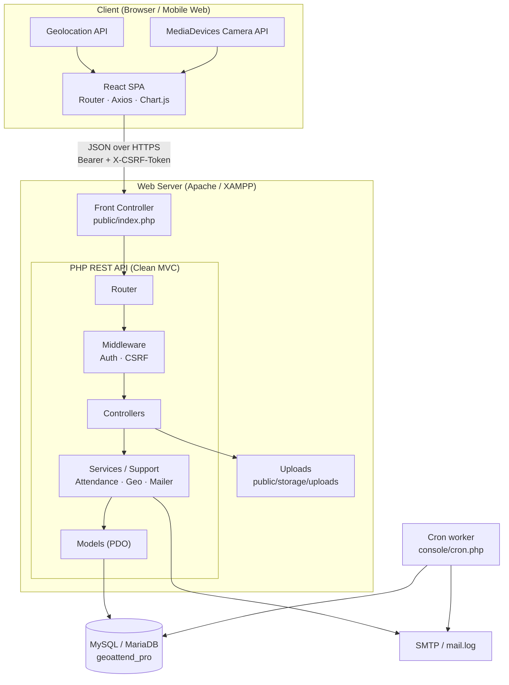
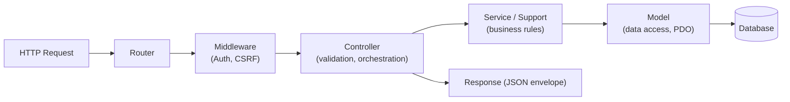
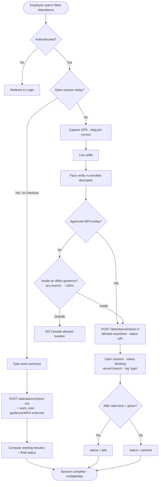
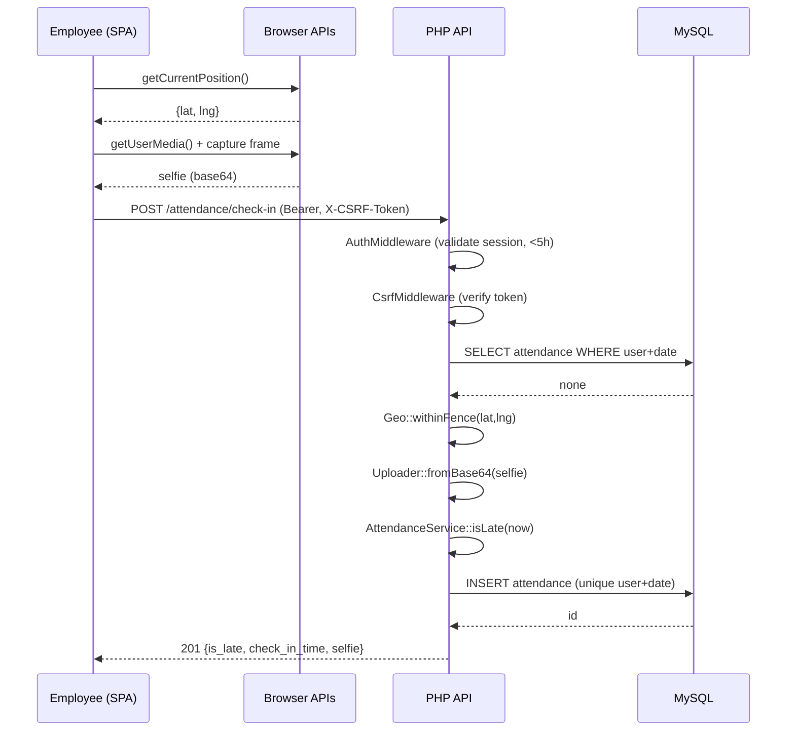
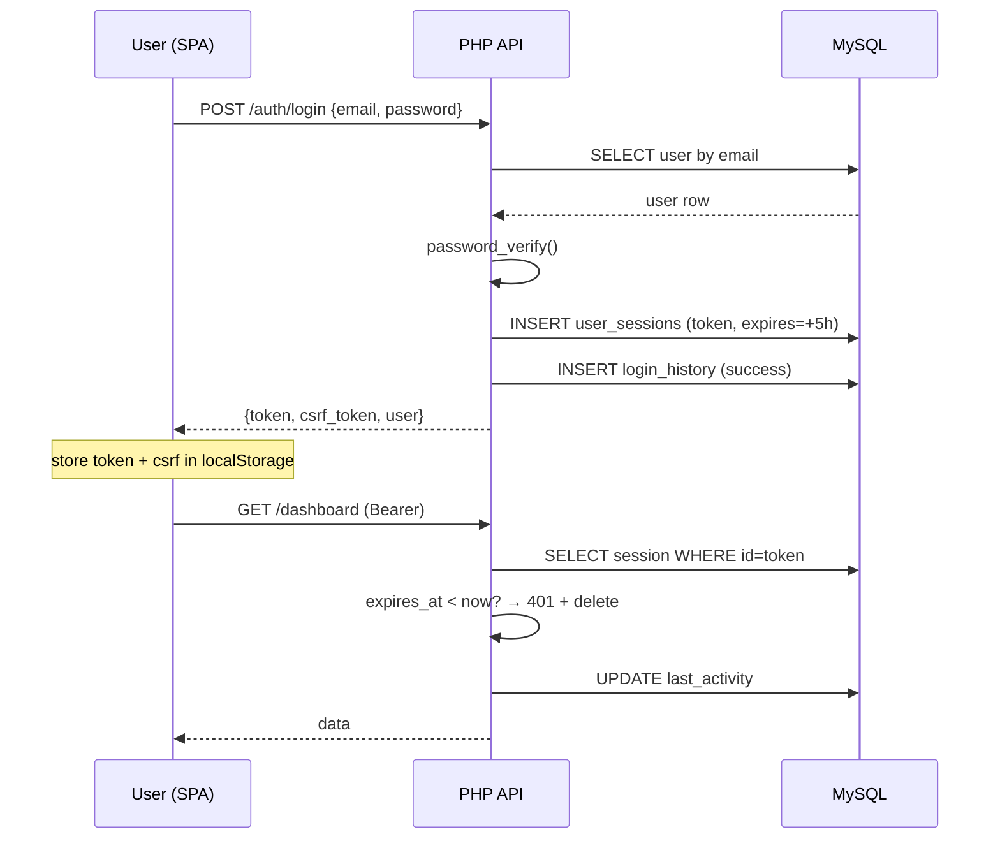
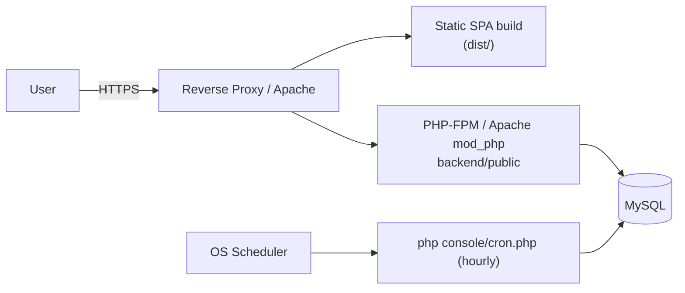

# System Architecture, Sequence & Workflow Diagrams

> Diagrams use **Mermaid** — render on GitHub, VS Code (Markdown Preview Mermaid), or mermaid.live.

## 1. System Architecture

## 2. Layered / Clean Architecture

## 3. Attendance Workflow

> After check-in the **work-tracking state machine** runs (Working → Overtime → Logged Out): a
> work-end popup offers *Logout / Continue Working*; the **Admin Live Status** board reflects each
> employee's state in real time. See README → *Work-tracking state machine*.

## 4. Sequence Diagram — Check-In

## 5. Sequence Diagram — Login + Session

## 6. Deployment Topology

