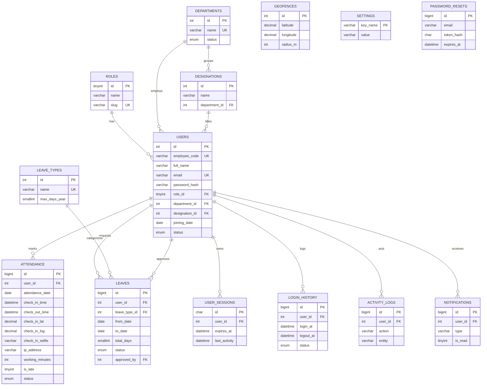

# ER Diagram & Database Design

Database: **`geoattend_pro`** · Engine: **InnoDB** · Charset: **utf8mb4**
Full DDL: [`backend/database/schema.sql`](../backend/database/schema.sql) · Seed: [`seed.sql`](../backend/database/seed.sql)

## 1. ER Diagram

## 2. Table Summary

| Table | Purpose | Key constraints |
|-------|---------|-----------------|
| `roles` | RBAC roles | `slug` unique |
| `departments` | Org departments | `name` unique |
| `designations` | Job titles | FK → departments |
| `users` | Auth + employee identity | `email`, `employee_code` unique; FKs role/dept/desig |
| `attendance` | One row per user per day | **UNIQUE(user_id, attendance_date)** ← duplicate guard |
| `leave_types` | Leave categories | `name` unique |
| `leaves` | Leave requests + approval | FKs user, type, approver |
| `geofences` | Allowed zones | radius in metres |
| `user_sessions` | Token sessions | `expires_at` indexed; FK user |
| `login_history` | Login/logout/expiry audit | status enum |
| `activity_logs` | Action audit trail | action indexed |
| `password_resets` | Reset tokens | `token_hash`, single-use |
| `notifications` | In-app + email | `is_read` indexed |
| `settings` | Key/value config | PK key_name |

## 3. Key Design Decisions
- **Unified `users` table** for auth + employee identity (an employee *is* a login).
- **`UNIQUE(user_id, attendance_date)`** enforces "one check-in per day" at the DB level —
  immune to application race conditions.
- **Coordinates** stored as `DECIMAL(10,7)` (~1 cm precision) — exact, unlike floats.
- **Sessions in DB** (not just JWT) so they can be force-expired/revoked (suspend user, password change).
- **`ON DELETE CASCADE`** for attendance/sessions/notifications; **`SET NULL`** for optional FKs.
